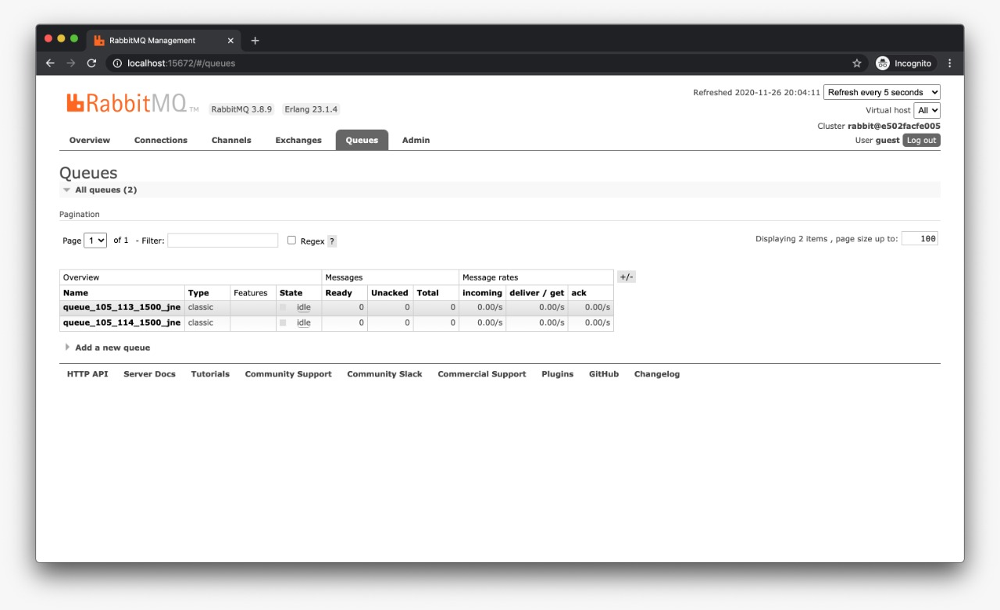

# Learn Simple API NodeJS + RajaOngkir + RabbitMQ

- Run `npm i --save`
- Copy `.env.example` to `.env` & Setting your environment
```
RO_URL_DEFAULT=
RO_API_KEY=

DB_HOST=127.0.0.1
DB_NAME=nodejs_rajaongkir
DB_USER=
DB_PASS=
```
- Runing App
```cmd
npm run start
```
- Testing URL API
```
POST => http://127.0.0.1:4000/api/cost
```
- Add body raw json
```json
{
    "origin": 105,
    "destination": [113, 114],
    "weight": 1500,
    "courier": "jne"
}
```
- Example response
```json
{
    "status": 200,
    "message": "Success",
    "data": [
        {
            "query": {
                "origin": 105,
                "destination": 113,
                "weight": 1500,
                "courier": "jne"
            },
            "status": {
                "code": 200,
                "description": "OK"
            },
            "origin_details": {
                "city_id": "105",
                "province_id": "10",
                "province": "Jawa Tengah",
                "type": "Kabupaten",
                "city_name": "Cilacap",
                "postal_code": "53211"
            },
            "destination_details": {
                "city_id": "113",
                "province_id": "10",
                "province": "Jawa Tengah",
                "type": "Kabupaten",
                "city_name": "Demak",
                "postal_code": "59519"
            },
            "results": [
                {
                    "code": "jne",
                    "name": "Jalur Nugraha Ekakurir (JNE)",
                    "costs": [
                        {
                            "service": "OKE",
                            "description": "Ongkos Kirim Ekonomis",
                            "cost": [
                                {
                                    "value": 26000,
                                    "etd": "3-6",
                                    "note": ""
                                }
                            ]
                        },
                        {
                            "service": "REG",
                            "description": "Layanan Reguler",
                            "cost": [
                                {
                                    "value": 30000,
                                    "etd": "2-3",
                                    "note": ""
                                }
                            ]
                        }
                    ]
                }
            ]
        },
        {
            "query": {
                "origin": 105,
                "destination": 114,
                "weight": 1500,
                "courier": "jne"
            },
            "status": {
                "code": 200,
                "description": "OK"
            },
            "origin_details": {
                "city_id": "105",
                "province_id": "10",
                "province": "Jawa Tengah",
                "type": "Kabupaten",
                "city_name": "Cilacap",
                "postal_code": "53211"
            },
            "destination_details": {
                "city_id": "114",
                "province_id": "1",
                "province": "Bali",
                "type": "Kota",
                "city_name": "Denpasar",
                "postal_code": "80227"
            },
            "results": [
                {
                    "code": "jne",
                    "name": "Jalur Nugraha Ekakurir (JNE)",
                    "costs": [
                        {
                            "service": "OKE",
                            "description": "Ongkos Kirim Ekonomis",
                            "cost": [
                                {
                                    "value": 64000,
                                    "etd": "2-3",
                                    "note": ""
                                }
                            ]
                        },
                        {
                            "service": "REG",
                            "description": "Layanan Reguler",
                            "cost": [
                                {
                                    "value": 70000,
                                    "etd": "1-2",
                                    "note": ""
                                }
                            ]
                        }
                    ]
                }
            ]
        }
    ]
}
```

- RabbitMQ Page


